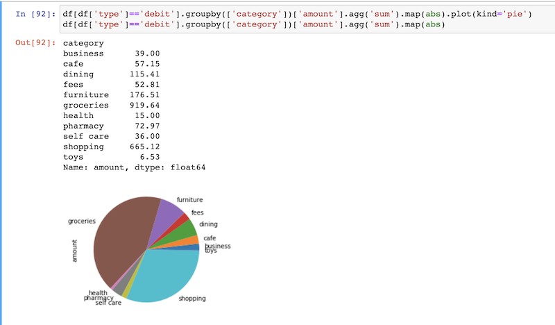

# Jupyter notebook (in python) to analyze spendings.




### See example of notebook here
[notebook preview](https://github.com/romaninozemtsev/personal_finance/blob/master/parse_bank_statement.ipynb)


### How to run
```
git clone https://github.com/romaninozemtsev/personal_finance.git
python3 -m venv venv
source venv/bin/activate
jupyter notebook parse_bank_statement.ipynb
```


### Features wanted

1. group by merchant
2. group by category.
3. tag cloud
4. interactice transactions list
5. detect subscriptions
6. detect bills


### Tasks list

- [x] Bank Of America CSV parser
- [ ] Chase CSV parser
- [ ] Better explicit schema for 'transaction' using typehints or smth like schmeatics.
- [ ] Separate config file for Merchants
- [ ] Description matchers should not apply tags. they come from merchant table.
- [ ] Web scraper instead of CSV
- [ ] Parse entire folder of CSV filles (mix of BofA and Chase)
- [ ] default tags vs custom tags
- [ ] config list of known subscriptions (e.g netflix is always subscription, but apple can be one time or both)


### How it works

Logically this is processing pipeline:

1. web ui (bank specific)
2. raw transactions CSV data (bank specific)
3. cleaned and stadardized to common format (stadardized)
4. extra data extracted: merchants, subscriptions, bills
5. enrich data: apply tags and categories
6. display : tables and charts; allow interactivity.


